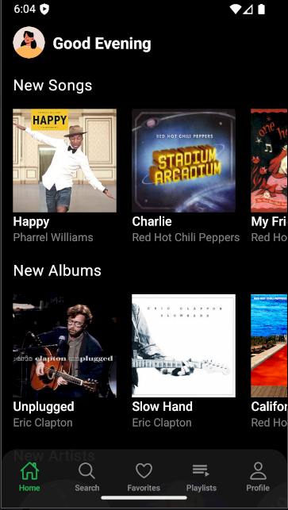

# 🎵 Online Music App — Backend
Backend part of online music streaming service built with NodeJS, ExpressJS, MongoDB.
Dockerized and Deployed on AWS ECS


<div align="middle">
  
  
  
  
</div>

## Features
* Songs, albums, artists, playlists, favorites
* Music player that works in background (on mobile lock screen, notifications)
* Tracks searching by name and artist

## Installation

```bash
npm install
```

## Run

```bash
npm run dev
```

Demo Web App: https://music-web-app-9xt9.onrender.com
